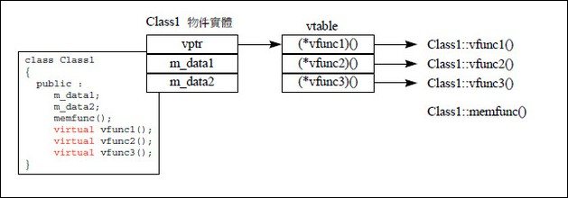
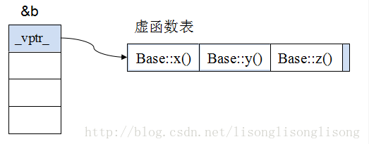
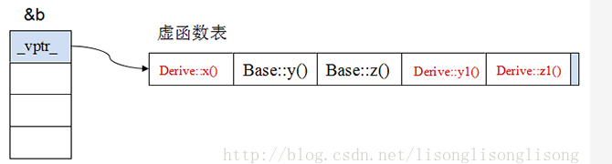
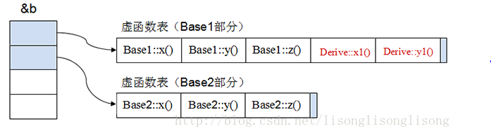

1. 引用和指针有什么区别  
* 定义一个指针变量，编译器会为它分配内存，而引用不占用任何内存；
* 引用必须在定义时被初始化，指针不必；
* 不存在指向空值的引用，但存在指向空值的指针  
2. 函数参数传递中值传递、地址传递、引用传递有什么区别
* 值传递：会为形参重新分配内存空间，将实参的值拷贝给形参，形参的值不会影响实参的值，函数调用结束后，形参被释放；
* 引用传递：不会为形参重新分配空间，形参只是实参的别名，形参的改变会影响实参的值，函数调用结束后，形参不会被释放；
* 地址传递：形参为指针变量，将实参的地址传递给函数，可以在函数中改变实参的值，调用时为形参指针变量分配内存，结束时释放指针变量。
3. static关键字有什么作用
* 函数体内static变量的作用范围为该函数体，不同于auto变量，该变量的内存只被分配一次，因此其值在下次调用时维持上次的值；
* 在模块内的static全局变量可以被模块内所有函数调用，但不能被模块外其他函数访问；
* 在模块内的static函数只能被这一模块内的其他函数调用，这个函数的适用范围被限制在声明它的模块内；
* 在类中的static成员变量属于整个类拥有，对类的对象只有一份拷贝；
* 在类中的static成员函数属于整个类拥有，这个函数不接受this指针，因而只能方访问static成员变量。
4. const关键字有什么作用？
* 阻止一个变量被改变，可以使用const关键字。在定义该const变量时，通常需要对它初始化，因为以后就没有机会改变它了；
* 对指针来说，可以指定指针本身为const，也可以指定指针所指的数据为const，或者二者同时指定为const；
* 在一个函数声明中，const可以修饰形参，表明它是一个输入参数，在函数内部不能改变其值；
* 对于类的成员函数，若指定其为const类型，则表明其是一个常函数，不能修改类的成员变量；
* 对于类的成员函数，有时候必须指定其返回值为const类型，以使得其返回值不为左值。
5. 链表和数组的区别在哪里？
* 链表和数组都可以叫线性表，数组又叫顺序表，主要区别在于，顺序表是在内存中开辟一段连续的空间来存储数据，而链表是靠指针来连接多块不连续的空间，在逻辑上行程一片连续的空间来存储数据；
* 数组要求空间连续，占用总空间小，链表不要求空间连续，占用总空间大；
* 数组方便排序和查找，但删除和插入较慢；链表方便删除和插入，但查找较慢，不方便排序。
6. 请编写能直接实现strlen()函数功能的代码
``` C++
int strlen(char *str) {
    int i = 0;
    for (;str[i] != '\0'; i++);
    return i;
}
```
7. 请编写能直接实现strstr()函数功能的代码
```C++
char *strstr(const char *str, const char *sub) {
    if (NULL == str1 || NULL == str2) {
        return NULL;
    }
    char *dest = (char *)str1;
    char *src = (char *)str2;
    char *flag = NULL;
    while(*dest) {
        flag = dest;
        src = (char *)str2;
        while(*flag && *src && (*flag == *src)) {
            flag++;
            src++;
        }
        if (!*src) {
            return dest;
        } else {
            dest++;
        }
    }
}
```
8. 进程和线程的差别  
线程是进程内的一个执行单元，也是进程内的可调度实体。进程和线程的区别：
* 调度：线程作为调度和分配的基本单位，进程作为拥有资源的基本单位
* 并发性：不仅进程之间可以并发执行，同一个进程的多个线程也可以并发执行
* 拥有资源：进程是拥有资源的一个独立单元，线程不拥有系统资源，但可以访问隶属于进程的资源
* 系统开销：在创建或撤销进程时，由于系统都要为之分配和回收资源，导致系统的开销明显大于创建或撤销线程时的开销。  
9. const char* const p 是什么意思
* char* const p  常量指针，p的地址不可修改
* char const *p  指向常量的指针，指向的内容不可修改
* const char *p  同char const *p
* const char * const p  内容和地址都不可以改变
10. memset、memcpy和strcpy的根本区别
* memset用来对一段内存空间内全部设置为某个字符，一般用在对定义的字符串进行初始化为指定值
* memcpy用来做内存拷贝，可以用来拷贝任何数据类型的对象，可以指定拷贝的数据长度
* strcpy只能拷贝字符串，遇到'\0'就结束拷贝
11. 析构函数有哪些特点
* 析构函数也是特殊的类成员函数，它没有返回类型
* 没有参数
* 没有重载
* public、private、protected等权限控制对析构函数无效
* 析构函数不能手动调用，只是在类对象生命周期结束的时候，由系统自动调用释放在构造函数中分配的资源
12. 虚函数有什么作用
* 虚函数的功能是使子类可以用同名的函数对父类函数进行覆盖，并且在通过父类指针调用时，如果有覆盖则自动调用子类覆盖函数，如果没有覆盖则调用父类中的函数，从而实现灵活扩展和多态性
* 如果是纯虚函数，则纯粹是为了在子类覆盖时有一个统一的命名而已，子类必须覆盖纯虚函数，否则子类也是抽象类
* 含有纯虚函数的类称为抽象类，不能实例化对象，主要用作接口类
13. 虚析构函数有什么作用
* 析构函数的工作方式是：最底层的派生类的析构函数最先被调用，然后调用每一个基类的析构函数
* 在C++中，当一个派生类对象通过使用一个基类指针删除，而这个基类有一个非虚的析构函数，则可能导致运行时派生类不能被销毁。然而基类部分很有可能已经被销毁，这就导致“部分析构”现象，造成内存泄露
* 给基类一个纯析构函数，删除一个派生类对象的时候就将销毁整个对象，包括父类和全部派生类部分
14. 分别给出bool、int、float、指针变量与零值比较的if语句
* bool型变量  if(!var)
* int型变量   if(var == 0)
* float型变量   const float EPSINON = 0.000001;  
                if ((x >= -EPSINON) && (x <= EPSINON))
* 指针变量  if (var == NULL)
15. 深度遍历二叉树
* 深度优先搜索算法：沿着树的深度遍历树的节点，尽可能深地搜索树的分支
* 广度优先搜索算法：又叫宽度优先搜索，或者横向优先搜索，是从根节点开始，沿着树的宽度遍历树的节点，如果所有节点均被访问，则算法停止。
16. C++中的inline内联函数与普通函数的区别
* 所谓“内联函数”就是将很简单的函数内嵌到调用它的程序代码中，这样做的目的是节约原本函数调用时的时空开销，但作为内联函数，函数体必须十分简单，不能含有循环、条件、选择等复杂的结构
* 内联函数和宏的区别在于，宏是由预处理器对宏进行替代，而内联函数是通过编译器控制来实现的。而且内联函数是真正的函数，只是在需要用到的时候内联函数会像宏一样展开，所以取消了函数的参数压栈，减少了调用的开销。可以像调用函数一样调用内联函数，而不必担心会产生处理宏的一些问题
* 可以用inline来敌营内联函数，不过，任何在类的说明部分定义的函数都会被自动的认为是内联函数。内联函数必须是和函数体声明在一起才有效。
17. C++重写、重载、重定义的区别
* 成员函数重载的特征   
  * 相同的范围，在同一个类
  * 函数名字相同
  * 参数不同
* 重写（覆盖）是指派生类函数覆盖基类函数，特征是
  * 不同的范围，分别位于基类和派生类中
  * 函数的名字相同
  * 参数相同
  * 基类函数必须有virtual关键字
* 重定义（隐藏）是指派生类的函数屏蔽了与其同名的基类函数，规则如下：
  * 如果派生类的函数和基类的函数同名，但是参数不同，此时不管有无virtual，基类的函数被隐藏
  * 如果派生类的函数与基类的函数同名，并且参数也相同，但是基类函数没有virtual关键字，此时基类函数被隐藏
18. 一个数据成员是否可以既是const又是static，如果不行，为什么
* 一个数据成员可以既是const又是static，表示为静态常量
* 常量一般在构造函数后初始化
* 静态成员一般在类外初始化
* 静态常量在类外初始化，但要在类外初始化的同时声明为const
19. 构造函数与析构函数的异同点
* 构造函数有以下特点：
  * 构造函数的名字必须与类名相同
  * 构造函数可以有任意类型的参数，但不能有返回类型
  * 定义对象时，编译系统会自动调用构造函数
  * 构造函数是特殊的成员函数，函数体可以再类体内也可以在类体外
  * 构造函数被声明为公有函数，但它不能像其他成员函数那样被显式调用，它是在定义对象的同时被调用的
* 析构函数有如下特点：
  * 析构函数的名字必须与类名相同，但它前面必须加一个波浪号
  * 析构函数没有参数，也没有返回值，而且不能被重载，因此在一个类中只能有一个析构函数
  * 当撤销对象时，编译系统会自动调用析构函数
  * 析构函数可以是virtual，而构造函数不能是虚函数
20. 自动调用复制构造函数的几种情形
* 复制构造函数的功能是用一个已知对象来初始化另一个同类的对象。复制构造函数其实也是类的构造函数，与类名相同，有且只有一个参数，是该类对象的引用；每个类必须有一个复制构造函数。如果定义类的时候没有编写，编译器编译时会自动生成一个复制构造函数
* 复制构造函数在以下三种情况下会被自动调用
  * 当类的一个对象去初始化该类的另一个对象时
  * 如果函数的形参是类的对象，调用函数进行形参和实参结合时
  * 如果函数的返回值是类对象，函数调用完成返回时
21.  类型转换构造函数是什么？举个例子    
类型转换构造函数就时自动调用类型匹配的构造函数，自动将基本数据类型转换成对象。例子如下：
``` C++
#include<iostream>
using namespace std;
class Person{
    public:
        double height;
        Person(double h) {height = h;}
};
void main() {
    Person yaoming = 2.3;
    count << yaoming.height<<endl;
}
```  
22.  简述C++异常处理方式  
一个典型的C++异常处理包括以下几个步骤：
* 程序执行时发生错误
* 以一个异常对象（最简单是一个整数）记录错误的原因及相关信息
* 程序检测到这个错误（读取异常对象）
* 程序决定如何处理错误
* 进行错误处理，并在此后恢复/终止程序的执行
23. 成员函数和友元函数的区别
* 成员函数是类定义的一部分，通过特定的对象来调用。成员函数既可以隐式访问调用对象的成员，而无需使用成员操作符
* 友元函数不是类的组成部分，因此被称为直接函数调用。友元函数不能隐式访问类成员，而必须将成员操作符用于作为参数传递的对象
24. C++中哪些运算符不可以重载
不能重载的5个运算符
* .
* ?:
* sizeof
* ::
* \*
25. 如何重载前++和后++运算符
前++不带参数，后++带一个int型参数以示区分
``` C++
iCount &operator ++() //前缀++
{
    count <<"前缀++"<<endl;
    m_data++;
    return *this;
}
```  
``` C++
iCount &operator ++(int) //后缀++
{
    count <<"后缀++"<<endl;
    iCount temp = *this;
    m_data++;
    return temp;
}
```  
26. 请说出STL标准模板库中的几个常用类  

数据结构 | 描述 | 实现头文件  
:-: | :-: | :-:  
向量（vector） | 连续存储的元素 | \<vector>    
列表（list） | 由节点组成的双向链表 | \<list>  
集合（set） | 由节点组成的集合 | \<set>  
栈（stack） | 后进先出的值的排列 | \<stack>  
队列（queue） | 先进先出的值的排列 | \<queue>  
映射（map） | 由键值对组成的集合 | \<map>  
27. 函数模板与函数重载的异同
* 函数的重载是指定义了几个名字相同，但参数的类型或参数的个数不同的函数
* 模板函数是指几个函数的具体算法相同，但参数类型不同的函数
* 模板函数可以减少重载函数，但也可能引发错误。
28. 类型转换构造函数是什么
类型转换构造函数就是自动调用类型匹配的构造函数，自动将基本数据类型转换成对象
29. C++中explicit关键字有什么作用
explicit和构造函数一起使用，explicit指明构造函数只能显式使用，目的是为了防止不必要的隐试调用类型转换构造函数
```C++
#include<iostream>
using namespace std;
class Person {
    int height;
    public: 
        Person(){}
        explicit Person(int h) //explicit修饰构造函数
        {
            height = h;
        }
        void display() {
            count <<height << endl;
        }
};

void main() {
    //Person yaoming = 2.3; //构造函数用explicit修饰后将不能隐式调用类型转换构造函数
    Person yaoming(2.3); //可以显式调用类型构造函数
}
```  
30. C++中restrict关键字有什么作用  
* restrict是用来优化的
* restrict只能修饰指针，restrict修饰的指针是能够访问所指区域的唯一入口，限制多个指针指向同一地址
31.  编写一个单例模式的例子  
    ```C++
    #include<iostream>
    using namespace std;
    class CSingleton {
        private:
            CSingleton{}//构造函数私有
            static CSingleton *m_pInstance;
        public:
            static CSingleton *GetInstance() {
                if (m_pInstance == NULL) //判断是否是第一次调用
                {
                    m_pInstance = new CSingleton();
                    return m_pInstance;
                }
            }
    };
    CSingleton *CSingleton::m_pInstance = NULL; //static属性类外初始化
    void main() {
        CSingleton *p1 = CSingleton::GetInstance();
        CSingleton *p2 = CSingleton::GetInstance();
        cout <<(p1 == p2) << endl; //结果为true表示单例
    }
    ```
32.   面向对象的三大特征是什么  
    面向对象的三个基本特征：封装、继承、多态

33.  什么是封装
* 封装是面向对象的特征之一，是对象和类概念的主要特性
* 封装，也就是把客观事物封装成抽象的类，并且类可以把自己的数据和方法只让可信的类或者对象操作，对不可信的进行信息隐藏
* 在C++中类中成员的属性有：public、protected、private，这三个属性的访问权限依次降低
34.   什么是继承
* 继承是指：可以使用现有类的所有功能，并在无需重新编写原来的类的情况下对这些功能进行扩展
* 通过继承创建的类被称为“子类”或“派生类”
* 被继承的类被称为“基类”、“父类”或“超类”
* 在某些OOP语言中，一个子类可以继承多个基类，但是一般情况下，一个子类只能有一个基类，要实现多重继承，可以通过多级继承来实现
* C++中可以用public、protected、private来修饰继承特性
35.  什么是多态
* 多态性：允许将父类对象设置为和一个或更多的它的子对象相等的技术，赋值之后，父对象可以根据当前赋值给它的子对象的特性以不同的方式运作。简单地说，允许将子类类型的指针赋值给父类型的指针
* 实现多态的两种方式：覆盖、重载
* 覆盖：子类重新定义父类的虚函数
* 重载：允许存在多个同名函数，而这些函数的参数表不同
36. 类与对象的区别？  
类域对象的区别，它们是一般与个体、抽象与具体、集体与个体的区别
36. C++中namespace是什么  
namespace是命名空间，是C++的语言特性，类似于java中的包
37. 什么是可重入和不可重入函数
* 什么是可重入性  
可重入函数可以由多个任务并发使用，而不必担心数据错误。相反，不可重入函数不能由多个任务共享，除非能确保函数的互斥。可重入函数可以再任意时刻被中断，稍后继续运行，不会丢失数据，可重入函数要么使用本地变量，要么使用全局变量来保护自己的数据
* 可重入函数  
不可连续的调用持有静态数据  
不返回指向静态数据的指针，所有数据都是由函数的调用者提供  
使用本地数据，或者通过制作全局数据的本地拷贝来保护全局数据  
如果必须访问全局变量，记住使用互斥信号量来保护全局变量  
绝不调用任何不可重入函数  
* 不可重入函数  
函数中使用了静态变量，无论是全局静态变量还是局部静态变量  
函数返回静态变量  
函数中调用了不可重入函数  
函数体内使用了静态的数据结构  
函数体内调用了malloc()或者free()函数  
函数体内调用了其他标准I/O函数  
总之，如果一个函数在重入条件下使用了未受保护的共享资源，那么就是不可重入的
39. vector的reserve和capacity的区别？  
reserve()用于让容器预留空间，避免再次分配内存；capacity()返回在重新进行分配以前所能容纳的元素数量
40. 如何初始化const和static数据成员  
通常在类外申明static成员，但是static const的整型（bool,char,int,long）可以在类中声明且初始化，static const其他类型必须在类外初始化（包括整型数组）
41. static和const分别怎么用，类里面static和const可以同时修饰成员函数吗  
static的作用  
* 对变量  
    * 局部变量：  
    在局部变量之前加上关键字static，局部变量就被定义为一个局部静态变量
    1. 内存中的位置：静态存储区
    2. 初始化：未经初始化的全局静态变量会被程序自动初始化为0（自动对象的值是任意的，除非它被显式初始化）
    3. 作用域：作用域仍为局部作用域，当定义它的函数或者语句块结束的时候，作用域也随之结束  
    注：当static用来修饰局部变量的时候，它就改变了局部变量的存储位置（从原来的栈中存放改为静态存储区）及其生命周期（局部静态变量在离开作用域后，并没有被销毁，而是仍然驻留在内存当中，直到程序结束，只不过我们不能再对它进行访问），但未改变其作用域  
    * 全局变量：  
    在全局变量之前加上关键字static，全局变量就被定义为一个全局静态变量
    1. 内存中的位置：静态存储区（静态存储区在整个程序运行期间都存在）
    2. 初始化：未经初始化的全局静态变量会被程序自动初始化为0（自动对象的值是任意的，除非它被显式初始化）
    3. 作用域：全局静态变量在声明它的文件之外是不可见的。准确地讲从定义之处开始到文件结尾  
    注：static修饰全局变量，并未改变其存储位置及生命周期，而是改变了其作用域，使当前文件外的源文件无法访问该变量，好处如下：（1）不会被其他文件所访问、修改（2）其他文件中可以使用相同名字的变量，不会发生冲突。**对全局函数也是有隐藏作用**。而普通全局变量只要定义了，任何地方都能使用，使用前需要声明所有.c文件，只能定义一次普通全局变量，但是可以声明多次（外部链接）。注意：全局变量的作用域是全局范围，但是在某个文件中使用时，必须先声明。
* 对类中的
    * 成员变量  
    用static修饰类的数据成员实际使其成为类的全局变量，会被类的所有对象共享，包括派生类的对象。因此，static成员必须在类外进行初始化（初始化格式：int base::var = 10;），而不能在构造函数内进行初始化，不过也可以用const修饰static数据成员在类内初始化。因为静态成员属于整个类，而不属于某个对象，如果在类内初始化，会导致每个对象都包含该静态成员，这是矛盾的。  
    特点：
    1. 不要试图在头文件中定义（初始化）静态数据成员。在大多数的情况下，这样做会引起重复定义这样的错误。即使加上#ifndef  #define  #endif或者#pragma once也不行
    2. 静态数据成员可以成为成员函数的可选参数，而普通数据成员则不可以。
    3. 静态数据成员的类型可以是所属类的类型，而普通数据成员则不可以。普通数据成员只能声明为所属类类型的指针或引用。
    * 成员函数
    1. 用static修饰成员函数，使这个类只存在这一份函数，所有对象共享该函数，不含this指针
    2. 静态成员是可以独立访问的，也就是说，无需创建任何对象实例就可以访问。base::func(5,3);当static成员函数在类外定义时不需要加static修饰符
    3. 在静态成员函数的实现中不能直接引用类中说明的非静态成员，可以引用类中说明的静态成员。因为静态成员函数不含this指针。  
**不可以同时用const和static修饰成员函数**  
C++编译器在实现const的成员函数的时候为了确保该函数不能修改类的实例的状态，会在函数中添加一个隐式的参数const this*。但当一个成员为static的时候，该函数是没有this指针的。也就是说此时const的用法和static是冲突的  
我们也可以这样理解：两者的语意是矛盾的。static的作用是表示该函数只作用在类型的静态变量上，与类的实例没有关系；而const的作用是确保函数不能被修改类的实例的状态，与类型的静态变量没有关系，因此不能同时用它们。
* const的作用
    1. 限定变量不可修改
    2. 限定成员函数不可以修改任何数据成员
    3. const与指针  
        const char *p 表示指向的内容不能改变
        char * const p，就是将p声明为常指针，它的地址不能改变，是固定的，但是它的内容可以改变
42. 指针和引用的区别  
本质上的区别是，指针是一个新的变量，只是这个变量存储的是另一个变量的地址，我们通过访问这个地址来修改变量。  
而引用只是一个别名，还是变量本身。对引用进行的任何操作就是对变量本身进行操作，以此达到修改变量的目的。  
    注：  
    * 指针：指针是一个变量，只不过这个变量存储的是一个地址，指向内存的一个存储单元；而引用跟原来的变量实质上是同一个东西，只不过是原变量的一个别名而已。如：  
    int a = 1; int *p = &a;  
    int a = 1; int &b = a;  
    上面定义了一个整型变量和一个指针变量p，该指针变量指向a的存储单元，即p的值是a存储单元的地址  
    而下面2句定义了一个整型变量a和这个变量的引用b，事实上a和b是同一个东西，在内存占有同一个存储单元。
    * 可以有const指针，但是没有const引用（const引用可读不可改，与绑定对象是否为const无关）  
    注：引用可以指向常量，也可以指向变量。例如int &a = b，使引用a指向b。而为了让引用指向常量，必须使用常量引用，如const int &a = 1;它代表的是引用a指向一个const int型，这个int型的值不能被改变，而不是引用a的指向不能被改变，因为引用的指向本来就是不可变的，无需加const声明。即指针存在常量指针int const *p和指针常量int *const p，而引用只存在常量引用int const &a，不存在引用常量int & const a。  
    * 指针可以有多级，但是引用只能是一级（int **p;合法，但是int &&a是不合法的）
    * 指针的值可以为空，但是引用的值不能为NULL，并且引用在定义的时候必须初始化
    * 指针的值在初始化后可以改变，即指向其他的存储单元，而引用在进行初始化后就不会再改变了
    * sizeof引用得到的是所指向的变量（对象）的大小，而sizeof指针得到的是指针本身的大小
    * 指针和引用的自增（++）运算意义不一样
    * 指针使用时需要解引用（*），引用则不需要  

43. 什么是多态，多态有什么用途  
C++多态有两种：静态多态（早绑定）、动态多态（晚绑定）。静态多态是通过函数重载实现的，动态多态是通过虚函数实现的  
* 定义：“一个接口，多种方法”，程序在运行时才决定要调用的函数
* 实现：C++多态性主要是通过虚函数实现的，虚函数允许子类重写override（注意和overload的区别，overload是重载，是允许同名函数的表现，这些函数参数列表/类型不同）。  
注：多态与非多态的实质区别就是函数地址是静态绑定还是动态绑定。如果函数的调用在编译器编译期间就可以确定函数的调用地址，并产生代码，说明地址是静态绑定的；如果函数调用的地址是需要在运行期间才确定，属于动态绑定  
* 目的：接口重用。封装可以使得代码模块化，继承可以扩展已存在的代码，他们的目的都是为了代码重用。而多态的目的则是为了接口重用。  
* 用法：声明基类的指针，利用该指针指向任意一个子类对象，调用相应的虚函数，可以根据指向的子类的不同而实现不同的方法  
用一句话概括：在基类的函数前加上virtual关键字，在派生类中重写该函数，运行时将会根据对象的实际类型来调用相应的函数。如果对象类型是派生类，就调用派生类的函数；如果对象类型是基类，就调用基类的函数  
```
关于重载、重写、隐藏的区别  
Overload（重载）：在C++程序中，可以将语义、功能相似的几个函数用同一个名字表示，但参数或返回值不同（包括类型、顺序不同），即函数重载  
1. 相同的范围（在同一个类中）；
2. 函数名字相同；
3. 参数不同；
4. virtual关键字可有可无  
Override（覆盖或重写）：是指派生类函数覆盖基类函数，特征是：
1. 不同的范围（分别位于派生类与基类）
2. 函数名字相同
3. 参数相同
4. 基类函数必须有virtual关键字  
注：重写基类虚函数的时候，会自动转换这个函数为virtual函数，不管有没有加virtual，因此重写的时候不加virtual也是可以的，不过为了易读性，还是加上比较好  
Overwrite（重写）：隐藏，是指派生类的函数屏蔽了与其同名的基类函数，规则如下：
1. 如果派生类的函数与基类的函数同名，但是参数不同，此时不论有无virtual关键字，基类的函数都将被隐藏（注意别与重载混淆）
2. 如果派生类的函数与基类的函数同名，并且参数也相同，但是基类函数没有virtual关键字，此时，基类的函数被隐藏（注意别与覆盖混淆）
```  
**虚函数表**  
多态是由虚函数实现的，而虚函数主要是通过虚函数表（V-Table）来实现的。  
如果一个类中包含虚函数（virtual修饰的函数）那么这个类就会包含一张虚函数表，虚函数表存储的每一项都是一个虚函数的地址。如下图：  
  
这个类的每一个对象都会包含一个虚指针（虚指针存在于对象实例地址的最前面，保证虚函数表有最高的性能），这个虚指针指向虚函数表。  
**注：对象不包含虚函数表，只有虚指针，类才包含虚函数表，派生类会生成一个兼容基类的虚函数表**  
* 原始基类的虚函数表  
    下图是原始基类的对象，可以看到虚指针在地址的最前面，指向基类的虚函数表（假设基类定义了3个虚函数）  
      
* 单继承时的虚函数（无重写基类虚函数）  
    假设现在派生类继承基类，并且重新定义了三个虚函数，派生类会自己产生一个兼容基类虚函数表的属于自己的虚函数表。  
      
    Derive Class继承了Base Class中的3个虚函数，准确说是该函数的实体地址被拷贝到Derive Class的虚函数列表中，派生类新增的虚函数置于虚函数列表后面，并按声明顺序摆放
* 单继承时的虚函数（重写基类虚函数）  
    现在派生类重写基类的X函数，可以看到这个派生类构建自己的虚函数表的时候，修改了base::x()这一项，指向了自己的虚函数  
      
* 多重继承时的虚函数（class Derived:public Base1，public Base2）  
    这个派生类多重继承了两个基类base1，base2，因此它有两个虚函数表  
      
它的对象会有多个虚指针（据说和编译器相关），指向不同的虚函数表  
**纯虚函数**  
定义：在很多情况下，基类本身生成对象是不合情理的。为了解决这个问题，方便使用类的多态性，引入了纯虚函数的概念，将函数定义为纯虚函数（方法：virtual Return Type Function()=0;）纯虚函数不能再在基类中实现，编译器要求在派生类中必须予以重写以实现多态性。同时含有纯虚函数的类称为抽象类，它不能生成对象。  
特点：  
* 当想在基类中抽象出一个方法，且该基类只能被继承，而不能被实例化；（避免类被实例化且在编译时候被发现，可以采用此方法）  
* 这个方法必须在派生类中被实现  
目的：使派生类仅仅只是继承函数的接口  
44. vector中size()和capacity()的区别  
size()指容器当前拥有的元素个数（对应的resize(size_type)会在容器添加或删除一些元素，来调整容器中实际的内容，使容器达到指定的大小）；capacity()指容器在必须分配存储空间之前可以存储的元素总数。  
size表示的这个vector里容纳了多少个元素，capacity表示vector能够容纳多少元素，它们的不同是在于vector的size是2倍增长的，如果vector的大小不够了，比如现在的capacity是4，插入到第5个元素的时候，此时会给它重新分配8个空间，把原来的数据及新的数据复制到这个新分配的空间里（会有迭代器失效的问题）。  
45. new和malloc的区别  
* new是运算符，malloc()是一个库函数
* new会调用构造函数，malloc不会
* new返回指定类型的指针，malloc返回void*指针，需要强制类型转换  
* new会自动计算需分配的空间，malloc不行
* new可以被重载，malloc不能  
* new可以被重载，malloc不能  
46. C++的内存分区  
* 栈区（stack）：主要存放函数参数以及局部变量，由系统自动分配释放  
* 堆区（heap）：由用户通过malloc/new手动申请，手动释放。注意它与数据结构中的堆是两回事，分配方式倒是类似于链表  
* 全局/静态区：存放全局变量、静态变量；程序结束后由系统释放  
* 字符串常量区：字符串常量就放在这里，程序结束后由系统释放  
* 代码区：存放程序的二进制代码  
47. vector、map、multimap、unordered_map、unordered_multimap的底层数据结构，以及几种map容器如何选择  
底层数据结构： 
    vector基于数组，map、multimap基于红黑树，unordered_map、unordered_multimap基于哈希表  
根据应用场景进行选择：   
    * map/unordered_map不允许重复元素
    * multimap/unordered_multimap允许重复元素
    * map/multimap底层基于红黑树，元素自动有序，且插入、删除效率高
    * unordered_map/unordered_multimap底层基于哈希表，故元素无序，查找效率高  
48. 内存泄露怎么产生的，如何避免  
* 内存泄漏一般是指堆内存的泄露，也就是程序在运行过程中动态申请的内存空间不再使用后，没有及时释放，导致那块内存不能再次被使用  
* 更广义的内存泄露还包括未对系统资源的及时释放，比如句柄、socket等没有使用相应的函数释放掉，导致系统资源的浪费    
**解决方法：**  
* 养成良好的编码习惯和规范，记得及时释放掉内存或系统资源
* 重载new和delete，以链表的形式自动管理分配的内存
* 使用智能指针，share_ptr、auto_ptr、weak_ptr  
49. const与#define的区别  
* 编译器处理方式  
define-在预处理阶段进行替换  
const-在编译时确定其值  
* 类型检查  
 define-无类型，不进行类型安全检查，可能会产生意想不到的错误  
 const-有类型，编译时会进行类型检查  
* 内存空间  
define-不分配内存，给出的是立即数，有多少次使用就进行多少次替换，在内存中会有多个拷贝，消耗内存大  
const-在静态存储区中分配空间，在程序运行过程中内存中只有一个拷贝  
* 其他  
在编译时，编译器通常不为const常量分配存储空间，而是将它们保存在符号表中，这使得它成为一个编译期间的常量，没有了存储与读内存的操作，使得它的效率也很高  
宏替换只作替换，不做计算，不做表达式求解  
50. struct与class的区别  
本质区别是访问的默认控制：默认的继承访问权限，class是private，struct是public  
51. sizeof和strlen的区别  
* 功能不同：  
    sizeof是操作符，参数为任意类型，主要计算类型占用内存大小  
    strlen()是函数，其函数原型为：extern unsigned int strlen(char *s);其参数为char\*，strlen只能计算以“\0”结尾字符串的长度，计算结果不包括"\0"  
* 参数不同： 
  当将字符数组作为sizeof()的参数时，计算字符数组占用内存大小；当将字符数组作为strlen()函数，字符数组转化为char*。因为sizeof的参数为任意类型，而strlen()函数参数只能为char\*，当参数不是char\*必须转换为char\*  
52. virtual，inline，decltype，volatile，static，const关键字的作用？使用场景？
* inline：在C/C++中，为了解决一些频繁调用的小函数大量消耗栈空间（栈内存）的问题，特别的引入了inline修饰符，表示为内联函数
* decltype：从表达式中推断出要定义变量的类型，但却不想用表达式的值去初始化变量。还有可能是函数的返回类型为某表达式的值类型
* volatile：volatile关键字是一种类型修饰符，用它声明的类型变量表示可以被某些编译器未知的因素更改，比如：操作系统、硬件或者其他线程等。遇到这个关键字声明的变量，编译器对访问该变量的代码就不再进行优化，从而可以提供对特殊地址的稳定访问。
* static：
  * 隐藏  
    在变量和函数名前面如果未加static，则它们是全局可见的。加了static，就会对其他源文件隐藏，利用这一特性，可以再不同的文件中定义同名函数和同名变量，而不必担心命名冲突。static可以用作函数和变量的前缀，对于函数来说，static的作用仅限于隐藏。
  * static变量中的记忆功能和全局生存期  
    存储在静态数据区的变量会在程序刚开始时就完成初始化，也是唯一一次初始化。共有两种变量存储在静态存储区：全局变量和static变量，只不过和全局变量比起来，static可以控制变量的可见范围，说到底，static还是用来隐藏的。**PS：如果作为static局部变量在函数内定义，它的生存期为整个源程序，但是其作用域仍与自动变量相同，只能在定义该变量的函数内使用该变量。退出该函数后，尽管该变量还继续存在，但不能使用它。**  
    ```C++
    ＃include <stdio.h>

    int fun(){
        static int count = 10;       //在第一次进入这个函数的时候，变量a被初始化为10！并接着自减1，以后每次进入该函数，a
        return count--;              //就不会被再次初始化了，仅进行自减1的操作；在static发明前，要达到同样的功能，则只能使用全局变量：    

    }

    int count = 1;

    int main(void)
    {
        printf("global\t\tlocal static\n");
        for(; count <= 10; ++count)
                printf("%d\t\t%d\n", count, fun());
        return 0;
    }
    ```  
    基于以上两点可以得出一个结论：把局部变量改为静态变量后是改变了它的存储方式即改变了它的生存期。把全局变量改变为静态变量后是改变了它的作用域，限制了它的使用范围。因此static这个说明符在不同的地方所起的作用是不同的。
  * static的第三个作用是默认初始化为0（static变量）  
**最后对static的三个作用做一句话总结。首先static的最主要功能是隐藏，其次因为static变量存放在静态存储区，所以它具备持久性和默认值0** 
  * static的第四个作用：C++中的类成员声明（有些地方与以上作用重叠）  
    在类中声明static变量或者函数时，初始化时使用作用域运算符来表明它所属的类。因此，静态数据成员是类的成员，而不是对象的成员，这样就出现以下作用：  
    1. 类的静态成员函数是属于整个类而非类的对象，所以它没有this指针，这就导致了它仅能访问类的静态数据和静态成员函数  
    2. 不能将静态成员函数定义为虚函数 
    3. 由于静态成员声明于类中，操作于其外，所以对其取地址操作，就多少有些特殊，变量地址是指向其数据类型的指针，函数地址类型是一个“nonmember函数指针” 
    4. 由于静态成员函数没有this指针，所以就差不多等同于nonmember函数，结果就产生了一个意想不到的好处，成为一个callback函数，使得我们得以将C++和C-based X Windows系统结合，同时也成功地应用于线程函数身上
    5. static并没有增加程序的时空开销，相反，它还缩短了子类对父类静态成员的访问时间，节省了子类的内存空间
    6. 静态数据成员在定义或说明是前面加关键字static
    7. 静态数据成员是静态存储的，所以必须对它进行初始化。（程序员手动初始化，否则编译时一般不会报错，但是在link时会报错）
    8. 静态成员初始化与一般数据成员初始化不同：  
        初始化在类外进行，而前面不加static，以免与一般静态变量或对象相混淆；  
        初始化时不加该成员的访问权限控制符private，public等  
        初始化时使用作用域运算符来标明它所属类  
        所以我们得出静态数据成员初始化的格式：  
        <数据类型><类名>::<静态数据成员名>=<值>  
    9. 为了防止父类的影响，可以在子类定义一个与父类相同的静态变量，以屏蔽父类的影响。这里有一点需要注意：我们说静态成员为父类和子类共享，但我们又重复定义了静态成员，这会不会引起错误呢？不会，我们的编译器采用了一种绝妙的手法，name-mangling用以生成唯一的标志  
53. 深拷贝与浅拷贝的区别  
* 什么时候用到拷贝函数？  
  * 一个对象以值传递的方式传入函数体
  * 一个对象以值传递的方式从函数返回
  * 一个对象需要通过另一个对象进行初始化  
  如果在类中没有显示地声明一个拷贝构造函数，那么编译器会自动生成一个默认的拷贝构造函数，该构造函数完成对象之间的位拷贝，位拷贝又被称为浅拷贝
* 是否应该自定义拷贝函数  
  自定义拷贝构造函数是一种良好的编程风格，它可以阻止编译器形成默认的拷贝构造函数，提高代码效率
* 什么叫深拷贝，什么是浅拷贝，两者异同？  
  如果一个类拥有资源，当这个类的对象发生复制过程的时候，资源重新分配，这个过程就是深拷贝，反之，没有重新分配资源，就是浅拷贝
* 深拷贝好还是浅拷贝好  
  如果实行浅拷贝，也就是把对象里的值完全复制给另一个对象，如A=B，这时，如果B中有一个成员变量指针已经申请了内存，那A中的那个成员变量也指向同一块内存。这就出现了问题，当B把内存释放了（如析构），这时，A的指针就是野指针了，出现运行错误。  
54. 派生类中构造函数，析构函数调用顺序  
    构造函数：“先基后派”；析构函数：“先派后基”  
55. C++类中数据成员初始化顺序  
* 成员变量在使用初始化列表初始化时，与构造函数中初始化成员列表的顺序无关，只与定义成员变量的顺序有关  
* 如果不使用初始化列表初始化，在构造函数内初始化时，此时与成员变量在构造函数中的位置有关
* 类中const成员变量必须在构造函数初始化列表中初始化  
* 类中static成员变量，只能在类内外初始化（同一类的所有实例共享静态成员变量）  
* 初始化顺序：  
  * 基类的静态变量或全局变量
  * 派生类的静态变量或全局变量
  * 基类的成员变量
  * 派生类的成员变量  
56. static_cast，dynamic_cast，const_cast，reinpreter_cast的区别  
static_cast与dynamic_cast
* cast发生的时间不同，一个是static编译时，一个是runtime运行时
* static_cast是相当于C的强制类型转换，用起来可能有一点危险，不提供运行时的检查来确保转换的安全性
* dynamic_cast用于转换指针和引用，不能用来转换对象——主要用于类层次间的上行转换和下行转换，还可以用于类之间的交叉转换。在类层次间进行上行转换时，dynamic_cast和static_cast的效果是一样的；在进行下行转换时，dynamic_cast具有类型检查的功能，比static_cast更安全。在多态类型之间的转换主要使用dynamic_cast，因为类型提供了运行时信息。  
  ```C++
    #include <iostream> 
    using namespace std; 
    class CBasic 
    { 
    public: 
        virtual int test(){return 0;} 
    }; 

    class CDerived : public CBasic 
    { 
    public: 
        virtual int test(){ return 1;} 
    }; 
    
    int main() 
    { 
        CBasic        cBasic; 
        CDerived    cDerived; 
        CBasic * pB1 = new CBasic; 
        CBasic * pB2 = new CDerived;
        CBasic * pB3 = new CBasic;
        CBasic * pB4 = new CDerived;
        
        
        //dynamic cast failed, so pD1 is null. 
        CDerived * pD1 = dynamic_cast<CDerived * > (pB1);    
                    
        //dynamic cast succeeded, so pD2 points to  CDerived object                                         
        CDerived * pD2 = dynamic_cast<CDerived * > (pB2);
        //pD3将是一个指向该CBasic类型对象的指针，对它进行CDerive类型的操作将是不安全的
        CDerived * pD3 = static_cast<CDerived * > (pB3);     
        //static_cast成功
        CDerived * pD4 = static_cast<CDerived * > (pB4);      
        
        //dynamci cast failed, so throw an exception.             
    //    CDerived & rD1 = dynamic_cast<CDerived &> (*pB1);    
    
    //dynamic cast succeeded, so rD2 references to CDerived object. 
        CDerived & rD2 = dynamic_cast<CDerived &> (*pB2);    
    
        return 0; 
    }
  ```  
  注：CBasic要有虚函数，否则会编译出错，static_cast则没有这个限制  
57. 智能指针
* 智能指针是在<memory>头文件中的std命名空间中定义的，该指针用于确保程序不存在内存和资源泄露且是异常安全的。它们对RAII“获取资源即初始化”编程至关重要，RAII的主要原则是为任何堆分配资源（如动态分配内存或系统对象句柄）的所有权提供给其析构函数包含用于删除或释放资源的代码及任何相关清理代码的堆栈分配对象。大多数情况下，当初始化原始指针或资源句柄以指向实际资源时，会立即将指针传递给智能指针。
* 智能指针的设计思想：将基本类型指针封装为类对象指针（这个类肯定是个模板，以适用不同基本类型的需求），并在析构函数里编写delete语句删除指针指向的内存空间。
* unique_ptr只允许基础指针的一个所有者。unique_ptr小巧高效，大小等同于一个指针且支持右值引用，从而可实现快速插入和对STL集合的检索。
* shared_ptr采用引用计数的智能指针，主要用于要将一个原始指针分配给多个所有者（例如，从容器返回了指针副本又想保留原始指针时）的情况。当所有的shared_prt所有者超出了范围或放弃所有权，才会删除原始指针。大小为两个指针：一个用于对象，另一个用于包含引用计数的共享控制块。最安全的分配和使用动态内存的方法是调用make_shared标准库函数，此函数在动态分配内存中分配一个对象并初始化它，返回对象的shared_ptr  
58. 计算类大小的例子  
    class A{}; sizeof(A) = 1;  
    class A{ virtual Fun(){} }; sizeof(A) = 4（32位机器）/8（64位机器）  
    class A{static int a;}; sizeof(A) = 1;  
    class A{int a;} ; sizeof(A) = 4;  
    class A{static int a; int b;}; sizeof(A) = 4;  
    类中用static声明的成员变量不计算入类的大小中，因为static data不是实例的一部分。static属于全局的，它不会占用类的存储，它有专门的地方存储（全局变量区）
59. 大端与小端的概念？各自的优势是什么？
* 大端与小端是用来描述多字节数据在内存中的存放顺序，即字节序。大端（Big Endian）指低地址端存放高位字节，小端（Little Endian）是指低地址端存放低位字节  
* 需要记住计算机是以字节为存储单位
* 为了方便记忆，可把大端与小端称作高尾端和低尾端，eg：如果是高尾端模式，一个字符串“11223344”把尾部“44”放在地址的高位，如果是低尾端模式，把“44”放在地址的地位  
* 各自优势：
  * Big Endian：符号位的判定固定位第一个字节，容易判断政府。
  * Little Endian：长度为1，2，4字节的数，排列方式都是一样的，数据类型转换非常方便
* 举一个例子，比如数字0X12 34 56 78在内存中的表示形式为：
  * 大端模式  
    低地址-------------->高地址  
    0x12 | 0x34 | 0x56 | 0x78  
  * 小端模式：
    低地址-------------->高地址  
    0x78 | 0x56 | 0x34 | 0x12  
60. c++中*和&同时使用是什么意思  
    ```C++  
    template<class T>  
    void InsertFront(Node <T>*&head,T item)
    ```  
上面一个函数的声明，其中第一个参数\*和&分别是什么意思  
head是个指针，前面为什么加个&  
本来“\*head”代表的是传指针的，但是只能改变head指向的内容，而“\*&head”意思是说head是传进来的指针的同名指针，就既能改变\*head指向的内容，又能改变head这个指针，比如：main()有个Node\<int>\* p,int t；当调用InsertFront(p,t)时，如果template\<class T> void InsertFront(Node\<T>\*&head, T item)中有对head进行赋值改变时，main()中的p也会跟着改变，如果没有&这个别名标识时，p则不会随着head的改变而改变。  
61. 定义一个空类，编译器做了哪些操作  
如果只是声明一个空类，不做任何操作的话，编译器会自动生成一个默认构造函数，一个默认拷贝构造函数，一个默认拷贝赋值操作符和一个默认析构函数。这些函数只有在第一次被调用时，才会被编译器创建。所有这些函数都是inline和public的。  
定义一个空类例如：
```C++
class Empty {}
```  

一个空的class在C++编译器处理过后就不再为空，编译器会自动的为我们声明一些member function，一般编译过就相当于： 
```C++ 
class Empty
{
public:
Empty(); // 缺省构造函数//
Empty( const Empty& ); // 拷贝构造函数//
~Empty(); // 析构函数//
Empty& operator=( const Empty& ); // 赋值运算符//
};
```  
需要注意的是，只有当你需要用到这些函数的时候，编译器才会去定义它们。  
62. 友元函数和友元类
* 友元函数：  
  友元函数是可以直接访问类的私有成员的非成员函数，它是定义在类外的普通函数，它不属于任何类，但需要在类的定义中加以声明，声明时只需在友元的名称前加上关键字friend，其格式如下：  
  friend 类型 函数名 （形参）;  
  友元函数的声明可以放在类的私有部分，也可以放在共有部分，它们是没有区别的，都说明是该类的一个友元函数  
  一个函数可以是多个类的友元函数，只需要在各个类中分别声明  
  友元函数的调用与一般函数的调用方式和原理一致  
* 友元类：
  友元类的所有成员函数都是另一个类的友元函数，都可以访问另一个类中的隐藏信息（包括私有成员和保护成员）  
  当希望一个类可以存取另一个类的私有成员时，可以将该类声明为另一类的友元类，定义友元类的语句格式如下：  
  friend class 类名;  
  其中：friend和class是关键字，类名必须是程序中的一个已定义过的类  
```C++
#include <iostream>
using namespace std;
    
    class Radius
{
    friend class Circle;                         //声明Circle为Radius的友元类
    friend void Show_r(Radius &n);     //声明Show_r为友元函数
public:
    Radius(int x)
    {
        r = x;
    }
    ~Radius()
    {
    }
    
private:
    int r;
};
    
void Show_r(Radius &n)
{
    cout<<"圆的半径为: "<<n.r<<endl;    //调用Radius对象的私有成员变量r
}
    
class Circle
{
public:
    Circle()    {}
    ~Circle(){}
    double area(Radius a)
    {
        s = a.r * a.r * 3.1415926;             //调用Radius对象的私有成员变量r
        return s;
    }
private:
    double s;
};
    
int main(int argc, char *argv[])
{
    Radius objRadius(9);
    Circle objCircle;
    
    Show_r( objRadius );
    cout<<"面积为："<<objCircle.area(objRadius)<<endl;
    
    return 0;
}
```  
**被声明两个类的友元声明**  
如果我们决定一个函数必须被声明为两个类的友元，则友元声明如下  
```C++
class Window; // 只声明 
class Screen
{
friend bool is_equal( Screen &, Window & );
// ...
};
    
class Window   
{    
friend bool is_equal( Screen &, Window & );  
// ...   
};
```   
**作为一个类的函数又是另一个类的友元**  
如果我们决定该函数必须作为一个类的成员函数并又是另一个类的友元，则成员函数声明和友元声明如下：  
```C++
class Window; 
class Screen
{
public:
// copy 是类 Screen 的成员  
Screen& copy( Window & );
// ... 
};
    
class Window    
{    
// copy 是类 Window 的一个友元    
friend Screen& Screen::copy( Window & );    
// ...    
};
```  
只有当一个类的定义已经被看到时它的成员函数才能被声明为另一个类的友元，这并不总是能够做到的。  
例如：  
```C++
class Window;  
class Screen      
{    
    friend class Window;    
    // ...    
};
```  
Screen类的非公有成员现在可以被Window的每个成员函数访问  
使用友元类时注意：  
* 友元关系不能被继承  
* 友元关系是单向的，不具有交换性。若类B是类A的友元，类A不一定是类B的友元，要看在类中是否有相应的声明
* 友元关系不具有传递性。若类B是类A的友元，类C是类B的友元，类C不一定是类A的友元，同样要看类中是否有相应的声明。  
63. 哪些函数不能成为虚函数？  
**不能被继承的函数和不能被重写的函数**  
* 普通函数  
  普通函数不属于成员函数，是不能被继承的。普通函数只能被重载，不能被重写，因此声明为虚函数是没有意义的。因为编译器会在编译时绑定函数  
  而多态体现在运行时绑定，通常通过基类指针指向子类对象实现多态。  
* 友元函数  
  友元函数不属于类的成员函数，不能被继承。对于没有继承特性的函数没有虚函数的说法  
* 构造函数  
  首先说下什么是构造函数，构造函数是用来初始化对象的。加入子类可以继承基类构造函数，那么子类对象的构造将使用基类的构造函数，而基类构造函数并不知道子类有什么成员，显然是不符合语义的。从另一个角度来讲，多态是通过基类指针指向子类对象来实现多态的，在对象构造之前并没有对象产生，因此无法使用多态特性，这是矛盾的。因此构造函数不允许继承。  
* 内联成员函数  
  我们需要知道内联函数就是为了在代码中直接展开，减少函数调用花费的代价。也就是说内联函数是在编译时展开的。而虚函数是为了实现多态，是在运行时绑定的。因此显然内联函数和多态的特性相违背。  
* 静态成员函数  
  首先静态成员函数理论是可继承的。但是静态成员函数是在编译时确定的，无法动态绑定，不支持多态，因此不能被重写，也就不能被声明为虚函数。  
64. vector扩容原理说明  
* 新增元素：vector通过一个连续的数组存放元素，如果集合已满，在新增数据的时候，就要分配一块更大的内存，将原来的数据复制过来，释放之前的内存，再插入新增的元素  
* 对vector的任何操作，一旦引起空间重新配置，指向原vector的所有迭代器就都失效了  
* 初始时刻vector的capacity为0，塞入第一个元素后capacity增加为1  
* 不同编译器实现的扩容方式不一样，VS2015中以1.5倍扩容，GCC以2倍扩容
  * vector在push_back以成倍增长可以在均摊后达到O(1)的时间复杂度，相对于增长指定大小的O(n)时间复杂度更好
  * 为了防止申请内存的浪费，现在使用较多的有2倍与1.5倍的增长方式，而1.5倍的增长方式可以更好的实现对内存的重复利用，因为更好。
65. 内联函数与普通函数的区别
* 内联函数和普通函数的参数传递机制相同，但是编译器会在每处调用内联函数的地方将内联函数内容展开，这样既避免了函数调用的开销，又没有宏机制的缺陷
* 普通函数在被调用的时候，系统首先要到函数的入口地址去执行函数体，执行完成之后再回到函数调用的地方继续执行，函数始终只有一个复制  
  内联函数不需要寻址，当执行到内联函数的时候，将此函数展开，如果程序中有N次调用了内联函数则会有N次展开函数代码
* 内联函数有一定的限制，内联函数体要求代码简单，不能包括复杂的结构控制语句。如果内联函数函数体过于复杂，编译器将自动把内联函数当成普通函数来执行。
66. C++中成员函数能够同时用static和const进行修饰吗？  
不能  
C++编译器在实现const的成员函数（const加在函数右边）的时候为了确保该函数不能修改类的中参数的值，会在函数中添加一个隐式的参数const this*。但当一个成员为static的时候，该函数是没有this指针的。也就是说此时const的用法和static是冲突的。  
即：static修饰的函数表示该函数是属于类的，而不是属于某一个对象的，没有this指针。const修饰的函数表示该函数不能改变this中的内容，会有一个隐含的const this指针。两者是矛盾的
67. vector中v[i]与v.at(i)的区别  
```C++
void f(vector<int> &v)
{
  v[5];    // A
  v.at[5];  // B
}
```  
如果v非空，A行和B行没有任何区别。如果v为空，B行会抛出std::out_of_range异常，A行的行为未定义  
C++标准不要求vector\<T>::operator[\]进行下标越界检查，原因是为了效率，总是强制下标越界检查会增加程序的性能开销。设计vector是用来代替内置数组的，所以效率问题也应该考虑。不过使用operator[]就要自己承担越界风险了。  
如果需要下标越界检查，请使用at。但是请注意，这时候的性能也是相应的会受影响，因为越界检查增加了性能的开销。